# MVP de Engenharia de Dados - atraso, pagamento e avaliação

**Autor:** Bruno Oliveira  
**Curso:** Pós-graduação em Engenharia de Dados - PUC-Rio

## Contexto de Negócio e Perguntas (Etapas 2 e 4.1)

Este MVP utiliza dados públicos do comércio eletrônico brasileiro para analisar
como o atraso na entrega se relaciona com a avaliação do cliente e se essa
relação muda conforme o valor da compra, a forma de pagamento e o parcelamento.

Em uma operação de comércio eletrônico, a avaliação registra parte da
experiência percebida pelo cliente. Entender sua relação com o prazo de entrega
ajuda a identificar em quais situações a insatisfação se torna mais frequente.
Também permite verificar se características comerciais, como valor da compra,
forma de pagamento e parcelamento, ajudam a diferenciar os grupos mais
sensíveis ao atraso.

O problema deste trabalho é organizar dados originalmente separados de pedidos,
itens, pagamentos e avaliações para produzir uma visão confiável por pedido. A
partir dela, procuro responder se o atraso está associado à piora das notas e
se essa relação muda conforme características da compra.

Desenvolvi o trabalho no Databricks Free Edition. Carreguei quatro arquivos CSV,
organizei o tratamento nas camadas Bronze, Silver e Gold e criei tabelas
analíticas com uma linha por pedido.

### Perguntas do MVP

1. Quem compra algo mais caro avalia pior quando a entrega atrasa?
2. Entre pedidos com atrasos semelhantes, a avaliação muda conforme a forma de pagamento ou o parcelamento?
3. Nos pedidos entregues no prazo, as avaliações ruins se concentram em alguma dessas características?

### Estrutura dos dados brutos

Os dados estão distribuídos em quatro arquivos relacionados pela chave
`order_id`. Pedidos contêm as datas e a situação da entrega; itens contêm os
produtos, preços e fretes; pagamentos registram modalidade, parcelas e valores;
e avaliações contêm a nota e as datas de criação e resposta.

| Arquivo | Nível do registro | Chave principal | Principais campos |
| --- | --- | --- | --- |
| Pedidos | Um pedido | `order_id` | cliente, status, data da compra, aprovação, entrega e previsão |
| Itens | Um item dentro do pedido | `order_id`, `order_item_id` | produto, vendedor, limite de envio, preço e frete |
| Pagamentos | Um registro de pagamento | `order_id`, `payment_sequential` | tipo, número de parcelas e valor pago |
| Avaliações | Uma avaliação do pedido | `review_id`, `order_id` | nota, comentário, data de criação e data da resposta |

Essa separação exigiu cuidado antes das junções, porque um pedido pode ter mais
de um item, pagamento ou avaliação.

## Busca pelos Dados (Etapa 4.1)

### Fonte e licença

Usei o [Olist Brazilian E-Commerce Public Dataset](https://www.kaggle.com/datasets/olistbr/brazilian-ecommerce), disponibilizado no Kaggle sob a licença
[CC BY-NC-SA 4.0](https://creativecommons.org/licenses/by-nc-sa/4.0/).

O uso neste projeto é exclusivamente acadêmico e sem finalidade comercial. Os
arquivos CSV originais não são redistribuídos neste repositório. Para reproduzir
o pipeline, eles devem ser obtidos diretamente na página da fonte.

Arquivos utilizados:

- `olist_orders_dataset.csv`
- `olist_order_items_dataset.csv`
- `olist_order_payments_dataset.csv`
- `olist_order_reviews_dataset.csv`

## Carga dos Dados (Etapa 4.2)

Baixei manualmente os quatro arquivos na página da Olist no Kaggle. Escolhi esse
caminho porque a base é estática e já atende às perguntas deste MVP. Antes da
carga, mantive os arquivos como foram recebidos.

Fiz a carga no Databricks Free Edition. Enviei os CSVs para o
volume `/Volumes/workspace/mvp_olist_bruno/dados/origem` e, a partir desse ponto,
o notebook leu os arquivos e gravou as tabelas Bronze. Depois disso, executei
todo o tratamento com Spark no próprio ambiente em nuvem.

Embora o carregamento inicial tenha sido manual, o pipeline foi organizado para
ser executado novamente sem acumular cópias dos mesmos pedidos. Em uma próxima
versão, eu faria a coleta por API e automatizaria a atualização dos dados.

## Modelagem e Catálogo de Dados (Etapa 4.3)

### Arquitetura do pipeline

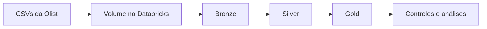

- **Bronze:** preservação da estrutura original, com identificação da fonte,
  lote e data da execução.
- **Silver:** conversão de tipos, aplicação de regras de qualidade e
  consolidação de itens, pagamentos e avaliações por pedido.
- **Gold:** visão analítica com uma linha por pedido e tabelas agregadas para
  responder às perguntas do MVP.

Ao final da execução, criei 18 tabelas permanentes: 4 na Bronze, 7 na Silver e
7 na Gold.

### Modelagem escolhida

Na camada Gold, adotei uma modelagem analítica **flat**, com uma linha por
pedido. Essa escolha facilita o cruzamento entre atraso, valor da compra, forma
de pagamento, parcelamento e avaliação. Antes das junções, itens, pagamentos e
avaliações são agrupados no nível do pedido. Com isso, um pedido com vários
itens, pagamentos ou avaliações não multiplica linhas e valores na tabela
final.

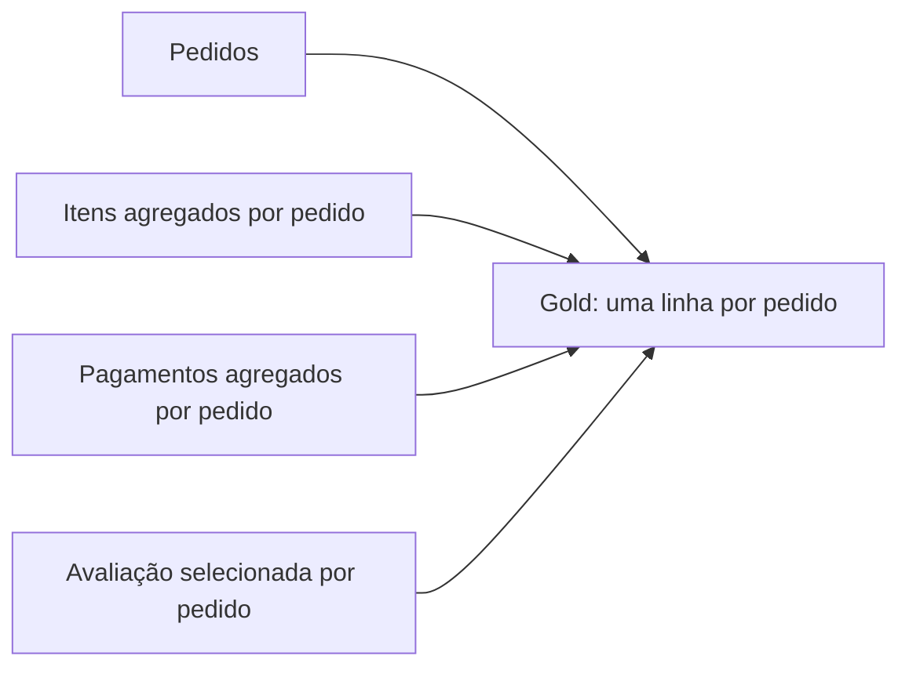

A tabela `gold_pedidos_analitico` é a visão principal desse modelo. As demais
tabelas Gold são agregações preparadas para responder às perguntas do MVP. O
detalhamento de tabelas, campos, tipos e regras está no
[catálogo de dados](docs/catalogo_dados.md).

### Linhagem resumida

| Destino | Origem | Transformação principal |
| --- | --- | --- |
| Bronze | Quatro CSVs da Olist | Leitura como texto e inclusão de arquivo, lote e data de ingestão |
| Silver de pedidos | Bronze de pedidos | Conversão de datas e validação da cronologia |
| Silver de itens | Bronze de itens | Conversão monetária, validação e consolidação por pedido |
| Silver de pagamentos | Bronze de pagamentos | Conversão, classificação das modalidades e consolidação por pedido |
| Silver de avaliações | Bronze de avaliações | Validação das notas e seleção da última avaliação válida por pedido |
| `gold_pedidos_analitico` | Tabelas Silver | Junções no nível de uma linha por pedido e criação das faixas analíticas |
| Tabelas Gold de resposta | `gold_pedidos_analitico` | Agregações por atraso, valor, pagamento, parcelamento e momento da avaliação |

### Principais regras do modelo

- Avaliações 1 e 2 são negativas, 3 é neutra e 4 e 5 são positivas.
- O valor da compra é a soma do preço dos produtos, sem incluir o frete.
- O atraso é calculado em dias corridos entre a entrega e a data prevista.
- A entrega na data prevista é considerada no prazo.
- Havendo mais de uma avaliação válida, é usada a resposta mais recente.
- Itens, pagamentos e avaliações são consolidados antes das junções para evitar
  multiplicação indevida de pedidos e valores.
- Grupos com menos de 30 pedidos são sinalizados e não recebem conclusões fortes.

## Pipeline de Dados (Etapa 4.4)

Organizei o pipeline em um único notebook PySpark, dividido em células de
configuração, Bronze, Silver, Gold, controles de qualidade e resultados. Mantive
as etapas no mesmo arquivo para facilitar a execução sequencial e a leitura do
fluxo completo. O código está em
[`notebooks/01_pipeline_olist.py`](notebooks/01_pipeline_olist.py), e a versão
executada, com as saídas, está em
[`docs/notebook_executado.html`](docs/notebook_executado.html).

| Transformação | Por que foi feita | Impacto controlado |
| --- | --- | --- |
| Leitura da Bronze como texto | Preservar o conteúdo recebido antes das conversões | Mantém a origem rastreável |
| Conversão explícita de datas e valores | Evitar comparações e somas com tipos incorretos | Falhas são marcadas, não convertidas silenciosamente em zero |
| Consolidação de itens por pedido | Um pedido pode possuir vários itens | Evita multiplicação de pedidos e valores nas junções |
| Consolidação de pagamentos por pedido | Um pedido pode ter vários registros e modalidades | Preserva o total e identifica pagamento combinado |
| Seleção da última avaliação válida | Um pedido pode possuir mais de uma avaliação | Mantém uma única nota principal e preserva a primeira para controle |
| Junções somente após as consolidações | As tabelas possuem relações de um para muitos | Mantém uma linha por pedido na Gold |
| Gravação com `overwrite` | A fonte é um retrato estático | Permite reprocessar sem acumular duplicidades |

Ao final, gravei 18 tabelas no schema
`workspace.mvp_olist_bruno`. A contagem de pedidos e a unicidade de `order_id`
são verificadas depois das junções; se a Gold perder ou multiplicar pedidos, a
execução é interrompida.

## Qualidade de Dados (Etapa 4.5)

Concentrei as verificações nos campos usados nas perguntas: chaves, datas,
notas, valores e parcelas. Quando encontrei um problema, mantive o registro com
um indicador de qualidade sempre que isso era possível. Ele só ficou fora da
análise que dependia daquele campo.

- 99.441 pedidos foram recebidos na Bronze e mantidos na Gold.
- Não foram encontrados `order_id` duplicados na Bronze nem na Gold.
- 95.801 pedidos formaram o recorte principal da análise.
- 23 pedidos apresentaram cronologia inválida.
- Não foram encontrados itens inválidos pelas regras aplicadas.
- 9 registros de pagamento apresentaram problema de conversão, campo vazio ou
  valor não positivo.
- 775 pedidos não tinham correspondência na base de itens, 1 não tinha
  pagamento e 768 não tinham avaliação válida.
- 303 pedidos apresentaram diferença acima de R$ 0,01 entre o total de itens
  mais frete e o total registrado nos pagamentos.
- 547 pedidos possuíam mais de uma avaliação.
- Em 201 pedidos, a primeira e a última notas válidas eram diferentes.
- 4.651 avaliações selecionadas foram registradas antes da entrega e foram
  consideradas uma limitação de interpretação.

Os 23 pedidos com cronologia inválida não entram no cálculo de atraso. Os 9
pagamentos inválidos são sinalizados e não entram nos recortes que dependem de
pagamento válido. Pedidos sem itens, pagamento ou avaliação continuam na visão
Gold para que eu consiga medir essas ausências. Em cada análise, a base de
cálculo usa somente os pedidos que possuem os dados necessários.

### Resumo das verificações

| Dimensão | O que verifiquei | Como tratei |
| --- | --- | --- |
| Completude | Falta de itens, pagamentos, avaliações e datas necessárias ao cálculo de atraso | Mantive o pedido na Gold e retirei somente do recorte que dependia do campo ausente |
| Consistência | Conversão de datas e valores, escala das notas, valores negativos ou não positivos e ordem das datas | Marquei os registros com indicadores de qualidade e não os usei no recorte afetado |
| Unicidade | Repetição de `order_id` na Bronze e na Gold | O pipeline interrompe a execução se a Gold tiver pedido duplicado ou perder pedidos |
| Acurácia possível | Diferença entre o total dos itens mais frete e o total pago | Registrei diferenças acima de R$ 0,01 para acompanhamento |
| Valores extremos | Valores altos não foram removidos apenas por serem altos | Usei faixas de valor e preservei os registros; uma análise de percentis seria uma melhoria futura |

Não fiz exclusão automática de valores extremos, porque uma compra de valor
alto pode ser válida. Para este MVP, preferi sinalizar valores impossíveis,
como negativos, e manter as compras válidas na análise.

## Análise de Dados (Etapa 4.5)

### Resultado geral: atraso e avaliação

O percentual de avaliações negativas foi de 9,26% nos pedidos entregues no
prazo, 32,13% nos atrasos de 1 a 3 dias, 67,68% nos atrasos de 4 a 7 dias,
80,15% entre 8 e 14 dias e 78,35% nos atrasos de 15 dias ou mais. A relação é
forte, mas não é estritamente crescente em todas as faixas.

### Pergunta 1 — Quem compra algo mais caro avalia pior quando a entrega atrasa?

Nas entregas no prazo, as compras acima de R$ 200 apresentaram 12,14% de
avaliações negativas, contra 7,91% nas compras de até R$ 50. Com atrasos mais
longos, essa diferença praticamente desapareceu. O valor do pedido não mostrou
um efeito constante quando combinado ao atraso. Portanto, os resultados não
sustentam que compras mais caras sejam sempre avaliadas pior quando atrasam.

### Pergunta 2 — A avaliação muda conforme o pagamento ou o parcelamento?

Boleto e cartão de crédito apresentaram percentuais praticamente iguais nos
pedidos entregues no prazo: 9,23% e 9,24%. O cartão teve percentuais maiores nos
atrasos curtos e médios, mas os resultados voltaram a se aproximar nos atrasos
mais longos. O parcelamento também não apresentou comportamento estável entre
as faixas. Há diferenças em alguns grupos, mas elas não se repetem de forma
consistente em todos os níveis de atraso.

No gráfico, concentrei a comparação em boleto e cartão de crédito porque são as
modalidades com maior volume e permitem uma leitura mais estável entre as
faixas. As outras modalidades continuam disponíveis na tabela Gold, mas alguns
grupos possuem menos de 30 pedidos e precisam ser lidos com cautela.

### Pergunta 3 — Onde se concentram as avaliações ruins nos pedidos no prazo?

Nos pedidos entregues no prazo, o maior percentual de avaliações negativas
apareceu nas compras acima de R$ 200. A forma de pagamento mostrou pouca
diferença, principalmente entre boleto e cartão de crédito. No cartão, os
pedidos em uma parcela tiveram 7,97% de avaliações negativas, contra 9,85% nos
pedidos em duas ou mais parcelas. Essa diferença é pequena diante do aumento
observado quando existe atraso e, isoladamente, não permite atribuir o resultado
ao parcelamento.

### Síntese

Minha leitura final é que o atraso está fortemente associado à piora da
avaliação. Valor, pagamento e parcelamento ajudam a detalhar determinados
grupos, mas não apresentaram um efeito consistente em todas as situações.

## Limitações

Esta análise compara os grupos encontrados na base, mas não prova relação de
causa e efeito. Parte das avaliações
foi respondida antes do registro da entrega; nesses casos, a nota representa a
experiência da compra até aquele momento, e não necessariamente uma opinião
sobre o produto recebido. A base também não permite medir expectativa individual
do cliente, inadimplência ou churn.

Esse ponto merece atenção: 4.651 avaliações foram respondidas antes da entrega,
e 78,33% delas foram negativas. Nas 91.150 avaliações respondidas na entrega ou
depois, o percentual negativo foi de 9,45%. São grupos com situações diferentes,
por isso essa comparação não prova que o momento da resposta causou a nota. Ela
mostra apenas que a composição dos grupos influencia a leitura do resultado.

## Autoavaliação

### Atingimento dos objetivos

Consegui construir e executar o pipeline completo no Databricks, desde a carga
dos quatro arquivos até a criação das tabelas Gold e das análises finais. As
três perguntas formuladas no início foram respondidas. O resultado mais claro
foi a associação entre atraso e avaliações negativas; valor, pagamento e
parcelamento ajudaram a detalhar grupos, mas não apresentaram comportamento
estável em todas as faixas. Considero que o objetivo do MVP foi atingido, sem
tratar as associações encontradas como prova de causa e efeito.

### Principal dificuldade

Foi meu primeiro trabalho no Databricks e com Spark. Minha maior dificuldade foi
entender o funcionamento do ambiente, desde a criação do volume e das tabelas
até a ordem de execução das células. Também precisei compreender por que itens,
pagamentos e avaliações deveriam ser agrupados antes das junções.

### Principal aprendizado

O trabalho me ajudou a entender na prática o papel das camadas Bronze, Silver e
Gold. Percebi que a análise depende de decisões tomadas bem antes dos gráficos:
converter os campos corretamente, controlar duplicidades, escolher o nível do
dado e conferir as junções. Também passei a conhecer melhor as opções do
Databricks e do Spark para organizar e tratar dados.

### O que eu melhoraria

Com mais tempo, eu trocaria o carregamento manual por uma coleta via API.
Também criaria uma rotina de atualização e alertas para falhas de execução ou
qualidade. Assim, o processo dependeria menos de upload manual.

## Evidências da Execução

As imagens abaixo registram a execução no Databricks. A versão completa do
notebook, com células, resultados e os quatro gráficos, também está disponível
em [`docs/notebook_executado.html`](docs/notebook_executado.html).

### Ambiente em nuvem e notebook

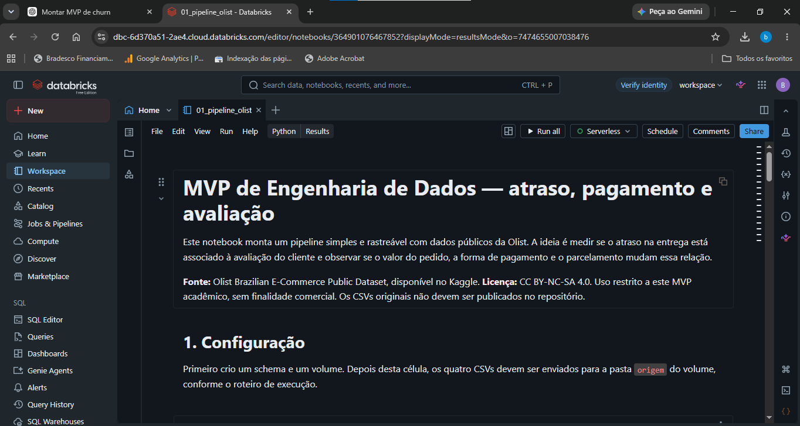

Executei o notebook no Databricks Free Edition, ambiente em nuvem usado em todo
o tratamento.

### Tabelas persistidas

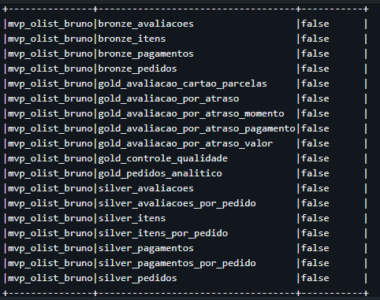

A consulta ao schema mostra as 18 tabelas permanentes criadas pelo pipeline.

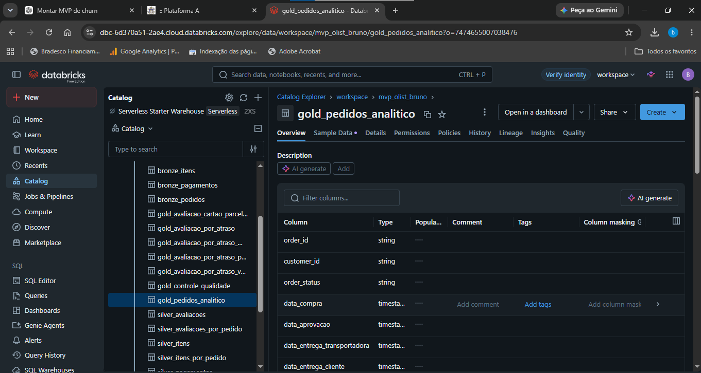

O Catalog Explorer confirma a persistência da tabela
`workspace.mvp_olist_bruno.gold_pedidos_analitico` e apresenta as colunas e os
tipos usados na visão final por pedido.

### Controle de qualidade

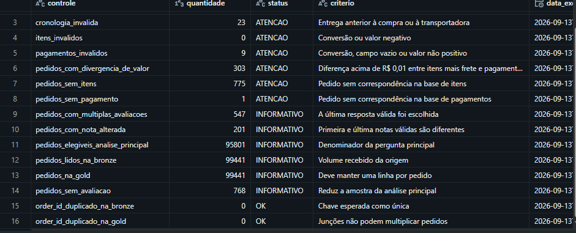

Os controles registram volumes, exceções e testes de chave e cardinalidade.

### Resultado geral de atraso

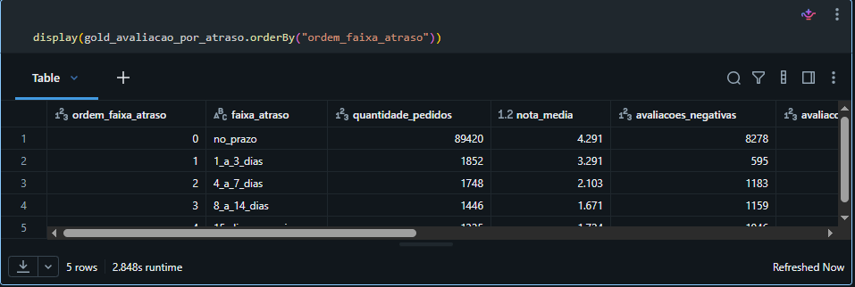

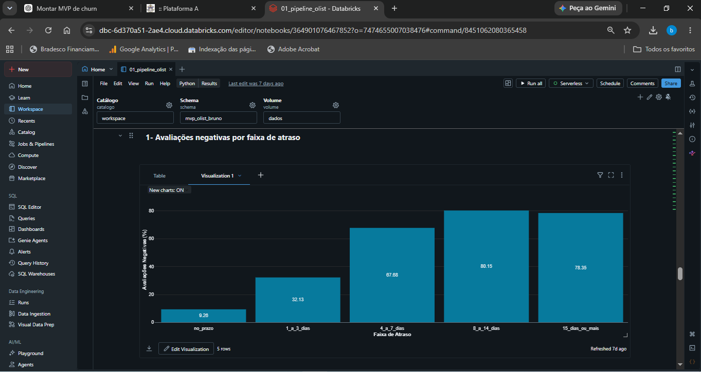

As duas evidências mostram o aumento das avaliações negativas quando a entrega
atrasa.

### Resultado por forma de pagamento

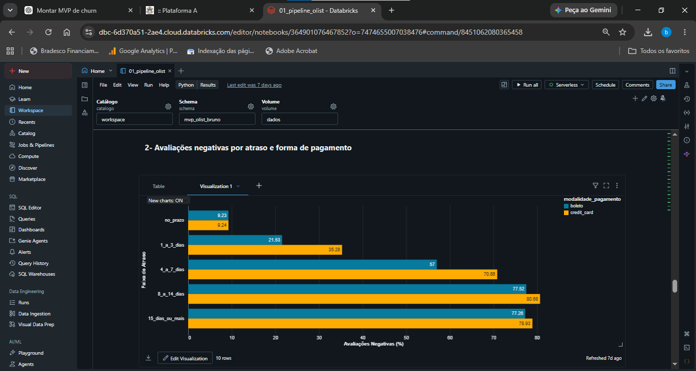

O gráfico mostra a comparação entre boleto e cartão de crédito dentro das
mesmas faixas de atraso.

### Resultado por valor do pedido

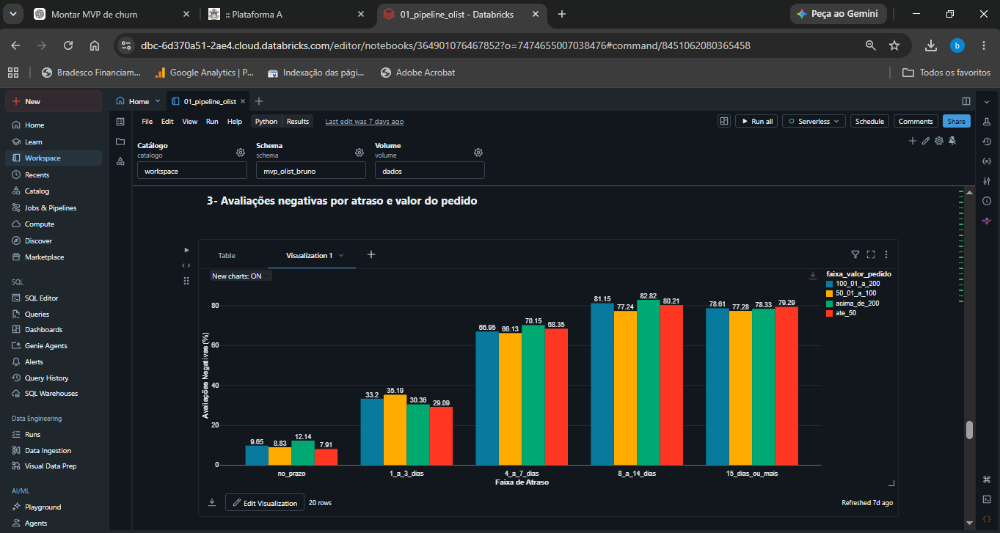

O gráfico permite comparar as faixas de valor dentro do mesmo nível de atraso.
As diferenças aparecem principalmente nos pedidos entregues no prazo e perdem
força quando o atraso aumenta.

### Resultado por parcelamento

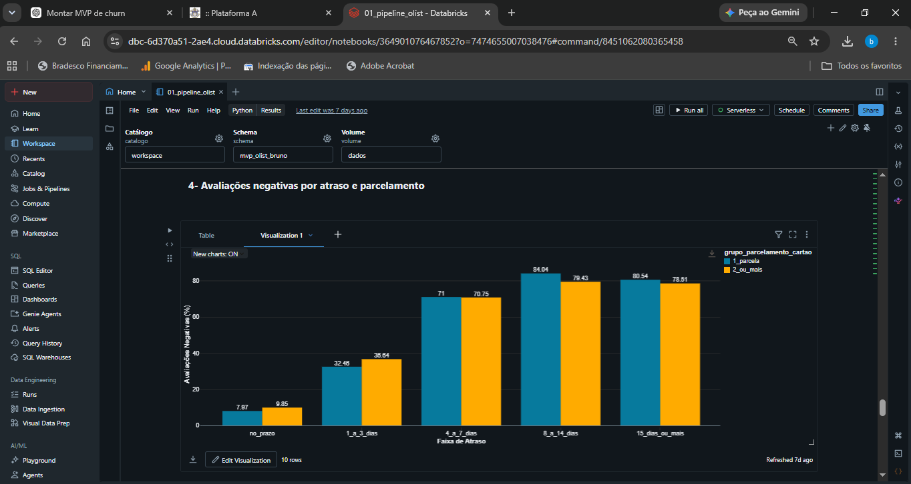

A comparação entre uma parcela e duas ou mais parcelas não apresenta uma
diferença estável em todas as faixas de atraso.

## Estrutura do repositório

```text
.
├── README.md
├── notebooks/
│   └── 01_pipeline_olist.py
├── docs/
│   ├── catalogo_dados.md
│   ├── notebook_executado.html
│   ├── roteiro_execucao_databricks.md
│   └── evidencias/
├── dados/
│   └── README.md
└── LICENCA_DADOS.md
```

## Como executar

1. Baixar os quatro arquivos na página da Olist no Kaggle.
2. Importar `notebooks/01_pipeline_olist.py` no Databricks.
3. Executar a primeira célula para criar o schema e o volume.
4. Enviar os CSVs para `/Volumes/workspace/mvp_olist_bruno/dados/origem`.
5. Executar o notebook completo e conferir a tabela de controle de qualidade.

Os valores padrão dos widgets são:

- catálogo: `workspace`
- schema: `mvp_olist_bruno`
- volume: `dados`

## Arquivos de apoio

- [Catálogo de dados](docs/catalogo_dados.md)
- [Notebook executado em HTML](docs/notebook_executado.html)
- [Roteiro de execução no Databricks](docs/roteiro_execucao_databricks.md)
